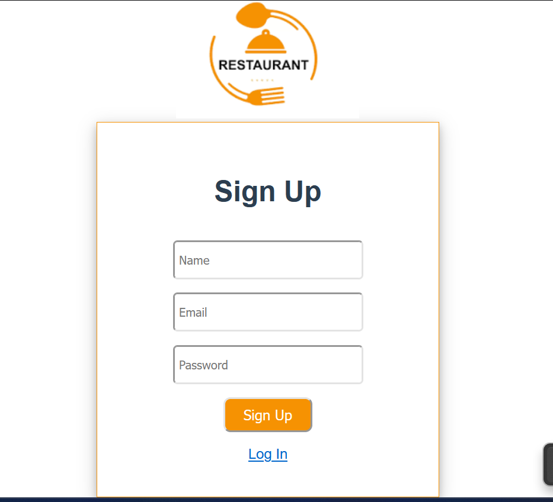
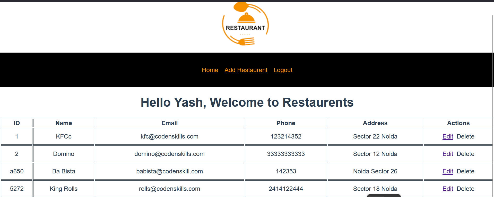
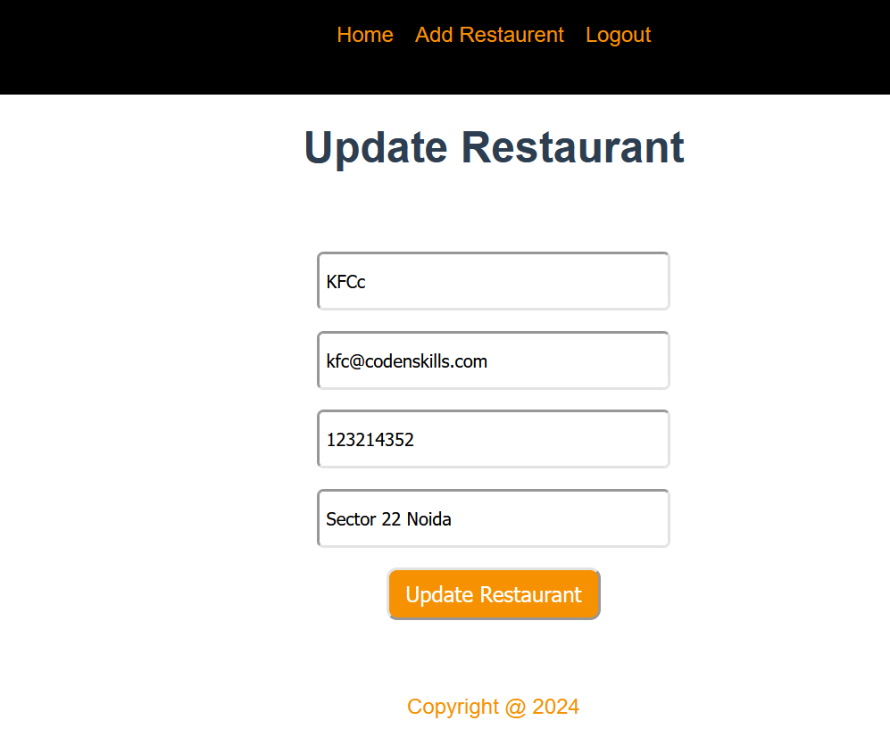

# restaurant

## Project setup

npm install -g @vue/cli

vue create restaurant

npm remove @vue/cli-plugin-eslint

npm i json-server

	create a db.json
	npx json-server db.json #Path where is create and store db.json file 
	
npm i axios
npm i vue-router@next

	make routes.js file in src folder
	import in main.js and use in use()
	remove template from app.vue file 
	call router in app.vue file

### Login Page

### Signup Page

### Home Page

### Edit Page

